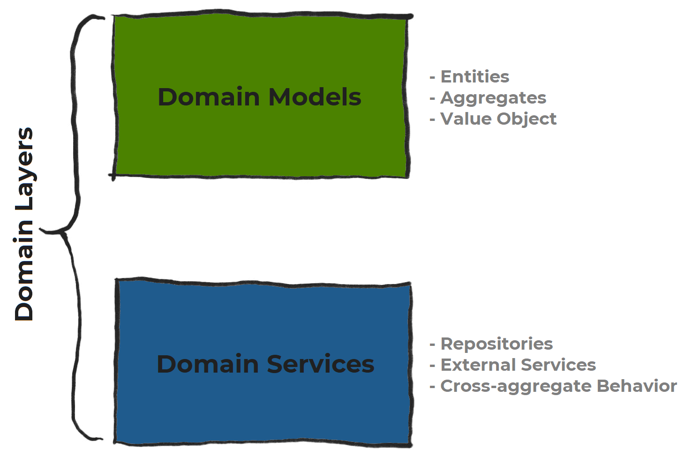

# This is a package for simpler approach to use of AWS services

## This package implements hexagonal architecture, also called Ports & Adapters Architecture
Hexagonal Architecture's two main benefits are Separation of Concerns and Dependency Injection
As Hexagonal Architecture is within the realm of *Domain Driven Design* it is a layered architecture in which the application and domain logic is inside the hexagon and other stuff is outside of it. Always on the left of the hexagon are kept the driving side of the project, which means that it starts the control flow from user or API stimuli, and on the right side of the hexagon are kept the driven side of the project, which means that it is controlled by the application or domain inside the hexagon.

- Ports will be (most of the time, depending on the language you choose) represented as interfaces in code. And is by placing these interfaces (or protocols) known as Ports in the correct location that we achieve the *Dependency Inversion Principle* and make the domain logic more long lived
- Driving Adapters will use a Port and an Application Service will implement the Interface defined by the Port, in this case both the Port’s interface and implementation are inside the Hexagon.
- Driven adapters will implement the Port and an Application Service will use it, in this case the Port is inside the Hexagon, but the implementation is in the Adapter, therefore outside of the Hexagon.

Por se tratar de algo dentro de DDD

https://docs.aws.amazon.com/prescriptive-guidance/latest/patterns/structure-a-python-project-in-hexagonal-architecture-using-aws-lambda.html
https://medium.com/ssense-tech/hexagonal-architecture-there-are-always-two-sides-to-every-story-bc0780ed7d9c
https://austinhenley.com/blog/challengingprojects.html